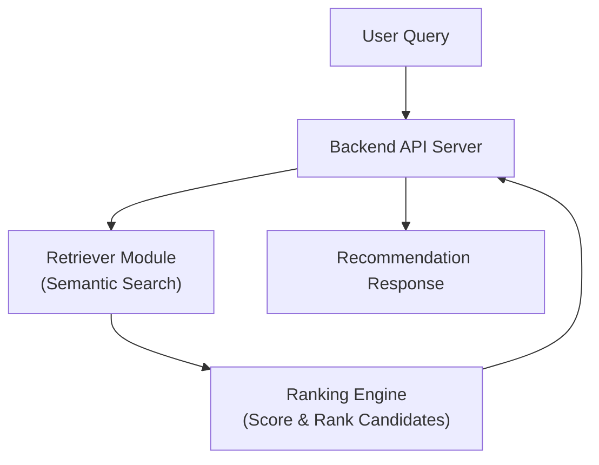

# System Architecture

This section explains the high-level architecture.

- **Retriever:** Uses semantic embeddings for API/document search.
- **Ranker:** Orders results based on task, relevance, and evaluation metrics.
- **Backend:** Exposes RESTful API endpoints for interaction.

See [Pipeline Flow](Pipeline_Flow.md) for end-to-end processing.